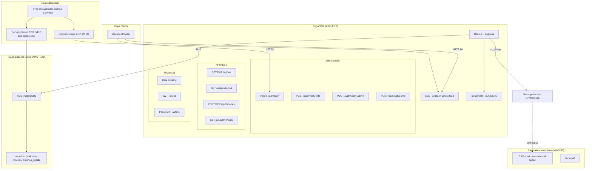

# Arquitectura FarmCruzAzul



## Flujo de Autenticación

```
1. Login:       Usuario + Contraseña → JWT Parcial
2. MFA:         Código Google Authenticator → Verificación TOTP
3. Admin:       Código Admin (3er factor) → JWT Completo
```

## Stack Tecnológico

| Componente | Tecnología |
|---|---|
| Frontend | HTML, CSS, JavaScript vanilla |
| Backend | Node.js + Express |
| Base de Datos | PostgreSQL 18 en AWS RDS |
| Autenticación | JWT, bcrypt, Speakeasy (TOTP) |
| Servidor | EC2 Amazon Linux 2023 |
| Almacenamiento | S3 (backups) |
| Despliegue | systemd, git |
